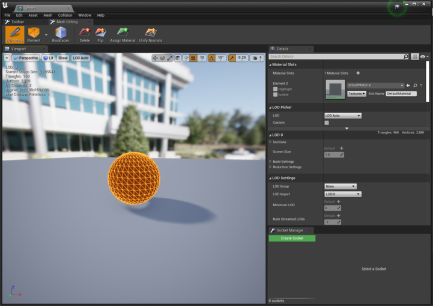

# Airsim Object Detection
In this repository you will find an object detection datasets generator (YOLO format) and some ways to get inference results.

## Dependencies

- Python packages: `pip3 install -r requirements.txt`
- Install Airsim  
    ```
    git clone https://bitbucket.org/fadacatec-ondemand/airsim
    cd airsim
    ./build.sh
    ./setup.sh   
    ```
- Install Python client
    ```
    cd airsim/PythonClient
    pip3 install msgpack-rpc-python
    pip3 install .
    ```
- Install Unreal Engine and airsim plugin. 

## Setup
- Open an Unreal Project and create a sphere actor.
- Enable **Polygon Editing** plugin and, in the sphere editor, select the entire element and flip normals.

    

- Check that the sphere is a stationary or movable object and change its scale as needed.

## Usage
Steps:

- Import 3D model of the object you want to detect.
- Get the ID names of the sphere and detection object items and change it into `get_files.py`.

    

- Run Unreal with AirSim plugin enabled.  
- Run `get_files.py` on a terminal and wait until the desired number of files are generated.  
- If you want to add or change backgrounds, download some HDRIs with **.ext** extension and save them on backgrounds directory. You can also use image formats such as **.jpg** or **.png**, but these may be distorted.

### Dataset format
```
Dataset
├── dataset.yaml
├── train
|   ├── images
|   |   ├── image_*.jpg
|   |   └── ...
|   └── labels
|       ├── label_*.txt
|       └── ...
└── valid
    ├── images
    |   ├── image_*.jpg
    |   └── ...
    └── labels    
        ├── label_*.txt
        └── ...
```

### utils directory
In this directory you can find two ways to get inference results:  

- `inference_unreal.py`: runs an object detection model on video coming from airsim.  
- `inference_webcam.py`: runs an object detection model on video coming from your webcam or any live video application.

Before running this scripts, you should train a pretrained model using the following command in the Dataset directory terminal:  
```
yolo detect train data=dataset.yaml model=extinguisher.pt epochs=100 imgsz=640
```  

You can also find the `gst-airsim-detection.py` script, which has been taken as an example for the realization of this repo.

